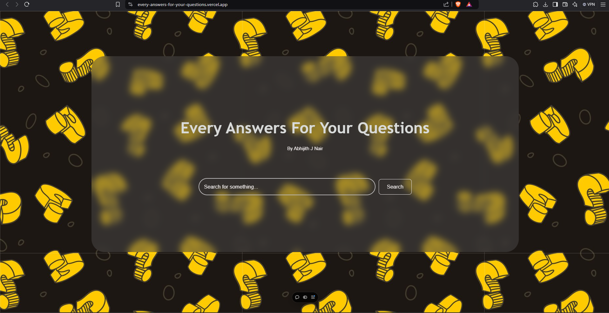

# Every-Answers-For-Your-Questions 🎯

## Basic Details
### Team Name: Abhijith J Nair

### Team Members
- Team Lead: Abhijith J Nair - College of Enginnering, Chengannur
  
### Project Description
It has the Answer for Every Question We ask. This project creation was fun and useful for me in the useless projects, Also, Note : "I never mentioned it will give the right answer!!" 

### The Problem (that doesn't exist)
Boredom of a Coder, Lonliness, A Useless Project Requirement for me in Useles Projects conducted by Tinkerhub CEC, and some time got spent. 

### The Solution (that nobody asked for)
Got a Wholesome Project, THis provides un the solution, but the one noboddy asked for, making it useless. 

## Technical Details
### Technologies/Components Used
- Languages : HTML, CSS, JavaScript
- Tools : VS CODE, OpenAI for Doubt clearings, Vercel for hosting the project.

### Implementation

# Installation
Nothing is installed for it, i used, Pure HTML, CSS and Javascript, with some Commitment to the project. Else, 2 external Images were used.

# Run
Used Live Server as the Extension with VS Code. Nothing ig.

### Project Documentation
For Software:

# Screenshots (Add at least 3)

The one and only UI that i had provided to the page, now here, We search in the search bar and tapping search button, will lead us to its Answer

Now we get a output as a Error Type of message, Dont fear, that the Authentic "Feature of the App" :)

i had also added Some mystery Gifts for the user, So that they also might feell good while using it. 

## Team Contributions
- Abhijith J Nair : Done the entire Project, except Sleeping!!
---
Made with ❤️ at TinkerHub Useless Projects 
